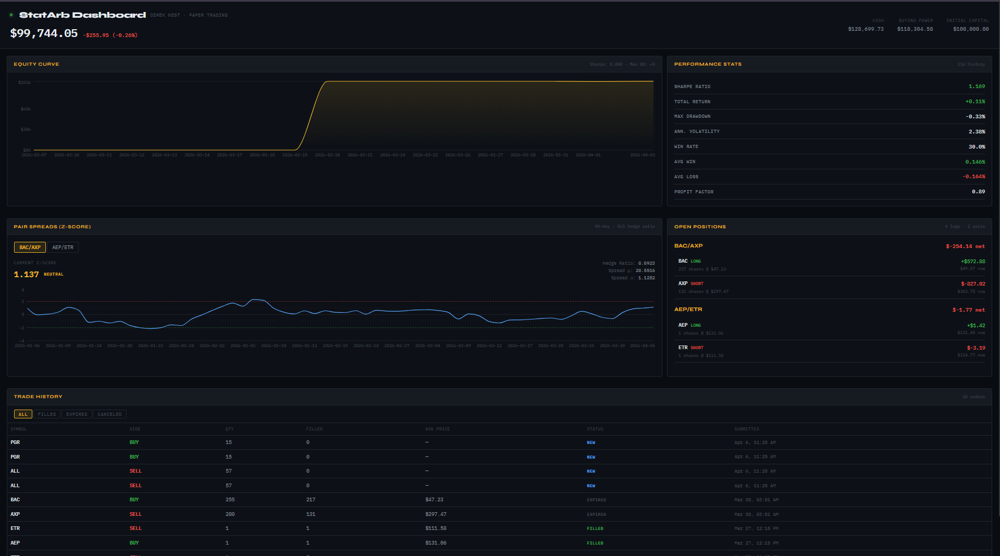

# StatArb Dashboard

Live monitoring dashboard for a pairs trading / statistical arbitrage engine running on Alpaca paper trading.

**Stack:** FastAPI · React · Recharts · alpaca-py · yfinance



## Features

- **Equity Curve** — live portfolio history with Sharpe ratio and max drawdown overlay
- **Pair Spread Visualizer** — 90-day z-score charts with OLS hedge ratios for BAC/AXP and AEP/ETR
- **Performance Stats** — Sharpe, drawdown, win rate, profit factor, annualized volatility
- **Open Positions** — individual legs + pair-level net P&L
- **Trade History** — all orders with fill prices, filterable by status
- Auto-refreshes every 30–60 seconds

## Setup

### 1. Backend

```bash
cd backend
cp .env.example .env
# Add your Alpaca paper trading API keys to .env

pip install -r requirements.txt
uvicorn main:app --reload --port 8000
```

### 2. Frontend

```bash
cd frontend
npm install
npm run dev
# Open http://localhost:5173
```

## Architecture

```
backend/
  main.py          # FastAPI app — Alpaca + yfinance data, quant math
  requirements.txt
  .env             # API keys (gitignored)

frontend/
  src/
    App.jsx
    components/
      PortfolioHeader.jsx   # Live equity + P&L banner
      EquityCurve.jsx       # Area chart of portfolio history
      Stats.jsx             # Sharpe, drawdown, win rate
      Positions.jsx         # Open legs + pair net P&L
      Spreads.jsx           # Z-score chart per pair
      Trades.jsx            # Order history table
    hooks/
      useApi.js             # Generic fetch hook with auto-refresh
```

## Pairs Traded

| Pair | Hedge Ratio | Strategy |
|------|------------|----------|
| BAC / AXP | OLS-fitted | Long BAC, Short AXP |
| AEP / ETR | OLS-fitted | Long AEP, Short ETR |

Entry/exit at ±2σ z-score thresholds, daily bars.

## Notes

- Paper trading only — no real capital at risk
- Spread data pulled from yfinance (90-day daily); Alpaca used for live account data
- Sharpe and drawdown computed server-side from portfolio history

---

Built by [Derek Nest](https://linkedin.com/in/dereknest) · [GitHub](https://github.com/DerekNest)
